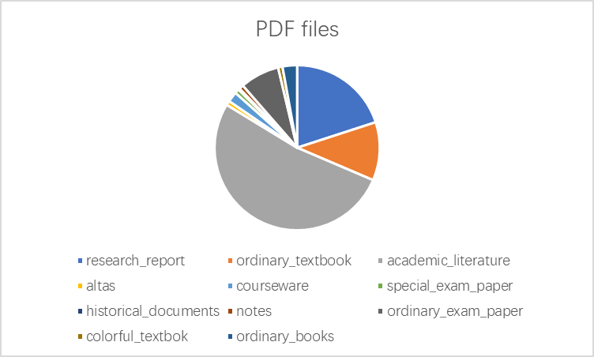
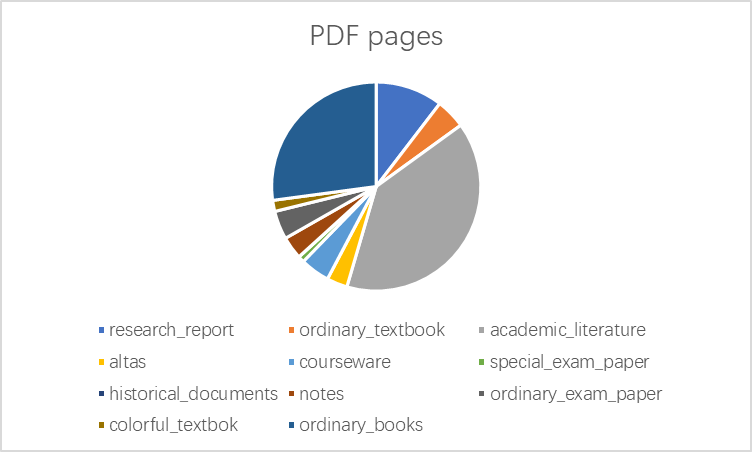
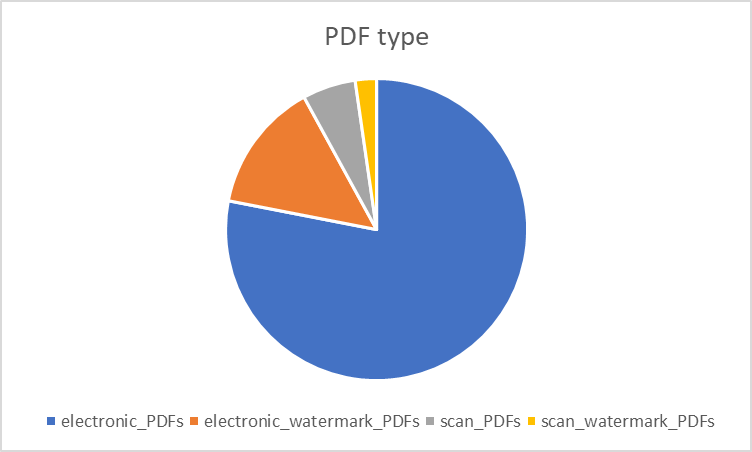
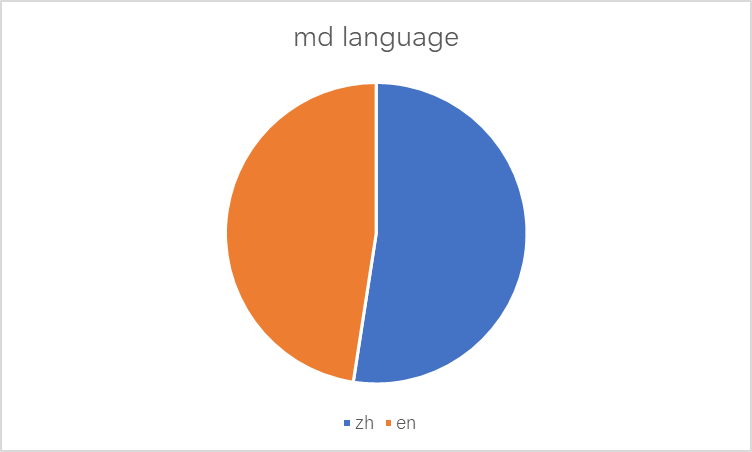
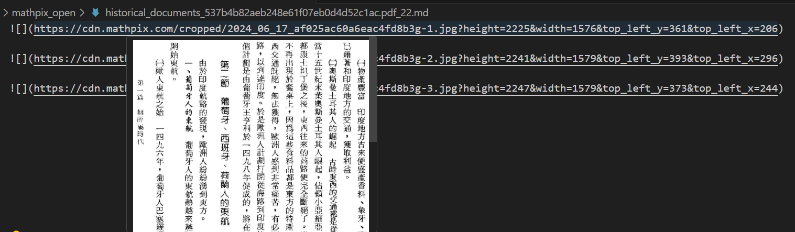
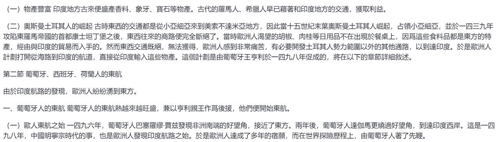
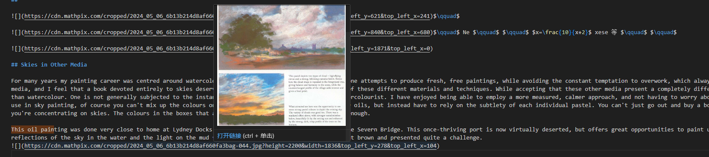
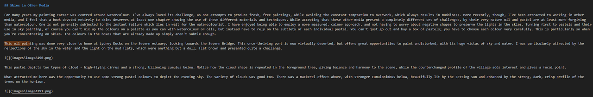

# Update
[2024/08] Repo update: code format and add limitations
# 简介
MPB（Miner-PDF-Benchmark）目标是面向大模型数据场景的端到端PDF文档理解验证集。它包含350个PDF文件和8410页PDF，包括书籍、教材、学术文献、PPT转PDF、试卷等11种类型的验证集。
# 验证集来源
MPB 验证集来源于多种渠道，包括 arXiv、Sci-Hub、教科书、试卷、历史文献等。不同子集的来源和组成如下：
 类别           | 对应标签             | 文件数 | 总页数 | 简介                                                                 |
|----------------|----------------------|--------|--------|--------------------------------------------------------------------|
| 研报           | research_report      | 70     | 875    | 来自于互联网的财报, 具有大型表格、复杂合并表格，横向表格混合正文、有单栏、双栏和复杂布局等特点      |
| 普通教材       | ordinary_textbook    | 40     | 388    | 来自于互联网的教材, 具有单栏布局，颜色为黑白，嵌套复杂公式和包含复杂大型矩阵的特点 |
| 学术文献       | academic_literature  | 183    | 3323   | 来自于arXiv和SCIHUB，具有含单栏、双栏、图表、公式等复杂版式的特点 |
| 图册           | atlas               | 3      | 269    | 来自于互联网的图册集, 具有单页包含大面积图片的特点  |
| PPT2PDF        | courseware          | 7      | 383    | 来自于互联网PPT转的PDF文件，有背景色，包含生物、语文、英语、物理4个学科 |
| 特殊图文试卷   | special_exam_paper   | 3      | 80     | 来自于互联网，具有版面为试卷、含水印、文字在图形中的特征的特点，内容包括小学拼音题目和数学试题等|
| 历史文献       | historical_document| 1      | 3      | 来自于互联网，具有排版为竖排，阅读顺序从右到左的特征，字体为繁体的特点 |
| 笔记           | note               | 3      | 293    | 来自于互联网，具有含手写体的特点，内容包括3个初中的学生手写笔记  |
| 普通试卷       | ordinary_exam_paper  | 27     | 372    | 来自于互联网，具有版面为试卷类型、背景黑白为主的特点，包括计算机科学、数学、语文等学科，涵盖小学、初中、高中、行业题库 |
| 特殊图文教材   | colorful_textbook    | 3      | 144    | 来自于互联网，具有包含特殊图文信息的特点，内容包括英语、数学、中文（含拼音）等学科 |
| 普通书         | ordinary_book       | 10     | 2280   | 来自于互联网书籍，特征为单栏布局、背景为黑白色的书 |

# 统计信息
<div style="display: flex;">
     
    
</div>
<div style="display: flex;">
     
    
</div>

# 验证集构建方法
当前版本的groudtruth构建过程是先通过[mathpix](https://mathpix.com/ocr)（参考[论文](https://arxiv.org/pdf/2312.17120)）抽取为markdown文件，再进行人工标注后生成。我们统计了人工标注前后对验证集的修正比例为328/350（按文件md5不一致统计）。不过，因为验证集数量较大，构成复杂，人工标注也会存在漏标、误标的情况。
## 标注说明
人工标注过程的检查项主要包括：
- 抽取内容的连贯性：需要抽取的文件是否符合正常阅读顺序，如检查页眉、页脚、边注、footnote等是否存在混入，文本分段是否正确。对不符合的进行修改；
- 抽取的完整性：检查水印是否去掉，除了文本中明确说明为图片或者封面，其他公式，表格等截图需要检查是否转为文本，针对漏抽、抽取错误进行修正；
- PDF文件分类的正确性：需要检查每一类PDF文件所属类别正确；
## 标注举例
文档1（竖版）：

人工标注前


经过人工标注后


文档2（图册）：

人工标注前



经过人工标注后

# 指标
当前我们验证集参考其他抽取工具中使用到的3个评估指标（bleu 和 edit distance 来自[nogout](https://arxiv.org/pdf/2308.13418v1)、similarity 来自[marker](https://github.com/VikParuchuri/marker)）进行评价。我们观察到部分工具在抽取过程中有抽取不到 Markdown 文档的情况，还增加了一个抽取率指标用作参考，定义是：成功生成 Markdown 文件的数量与总PDF文件数的比例，但该指标不会检查生成 Markdown 的内容是否异常。
# 使用方法
1. 克隆项目
```shell
git clone https://github.com/opendatalab/Miner-PDF-Benchmark
cd Miner-PDF-Benchmark
```
2. 安装依赖(推荐使用Python 3.9)
```shell
python -m pip install -r requirements.txt
```
3. 下载评测集

准备评测集，并将评测集解压到`datasets`目录下，确保`datasets`目录下为pdf和annotations。 准备的评测集，经过组织后目录如下：
```shell
- Miner-PDF-Benchmark/
  - datasets/
    - academic_literature/
      - annotations/
        - academic_literature_xx.md
      - pdf/ 
    - atlas/
      - annotations/
        - atlas_xx.md
      - pdf/
    - ...
  - evaluate_tool/
```
4. 评测集预处理

由于当前未对评测集中的图片评测，您需要执行以下命令对图片预处理：
```shell
cd evaluate_tool
python clean_photo.py --tool_name annotations --download_dir ../datasets
```
5. 待评估工具的评测结果准备

请将您需要评估工具生成的 Markdown 文件按照类型复制到`datasets/document_types/tool_name`目录中,`document_types`为11种类别对应的标签,`tool_name`为您的工具名称。 复制后的目录结构如下：
```shell
- Miner-PDF-Benchmark/
  - datasets/
    - academic_literature/
      - annotations/
        - academic_literature_xx.md
      - tool_name/
        - academic_literature_xx.md
      - pdf/ 
    - atlas/
      - tool_name/
        - atlas_xx.md
    - ...
```
执行以下命令对您待评估工具生成的进行预处理：
```shell
cd evaluate_tool
python clean_photo.py --tool_name tool_name --download_dir ../datasets/
```
6. 计算分数

请执行以下命令计算分数, 其中`--tool_name`为您待评估的工具名称, `--document_types`为可选的11种类型对应标签，默认包含所有类型，您也可以指定需要评估的某个或多个类型，多个类型请用空格分开; `--download_dir`指定 json 文件保存的路径。
```shell
cd evaluate_tool
python markdown_calculate.py --tool_name tool_name --download_dir ../datasets/ --document_types <document_types> --results xx.json
```
# 使用示例
使用评估工具对`marker`工具的学术文献类型进行评估，并生成结果文件。示例如下：
```shell
cd evaluate_tool
python clean_photo.py --tool_name annotations --download_dir ../datasets/
python clean_photo.py --tool_name marker --download_dir ../datasets/
python markdown_calculate.py --tool_name marker --download_dir ../datasets/ --results result.json --document_types academic_literature 
```
结果文件见生成的 [result.json](./evaluate_tool/result.json), 该文件包含了每个 PDF 文件对应的分数，以及所选`document_types`的分数，以及整体平均分数。
# 局限性
1. 因为验证集量大，构成复杂，我们的标注方法和正确性会持续迭代，当前仍有漏标注等情况，如有少量公式、表格等存在图片没有标注为预期格式等；
2. 不同版本的 latex 公式会有差异，目前没有处理这部分的差异带来的影响；
3. 由于不同抽取工具的表格格式存在差异，且计算过程图片不参与计算；采用开源库(`pandoc`)转换到`markdown`格式，并使用正则表达式清洗图片，这个过程会存在误差;
4. 换行和空格对编辑距离指标有影响，目前会替换后再计算得分；
5. `nogout`输出 mmd, 暂作为 md 比较;
6. 评估过程中，如果因为评测工具自身原因（如某工具处理超时，工具限制文件大小，或者 latex 表格偶发失败等）导致抽取失败，间接导致评测结果受影响，暂时没有额外修正处理;
# TODO
- 验证集完善（数据集多样性、标注准确性等方面）
- 更大程度提升 PDF 人工标注效率
- 评估指标完善
# 贡献
本项目仍在完善中，并在内部项目中验证使用，未来我们将逐步完善验证集、评测指标等，并在完善后开放验证集下载，欢迎社区开发者参与讨论和贡献。
# 致谢
- [marker](https://github.com/VikParuchuri/marker)

